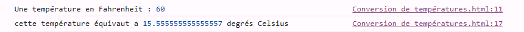
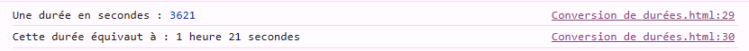
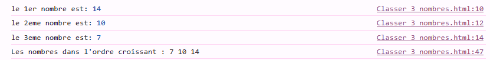
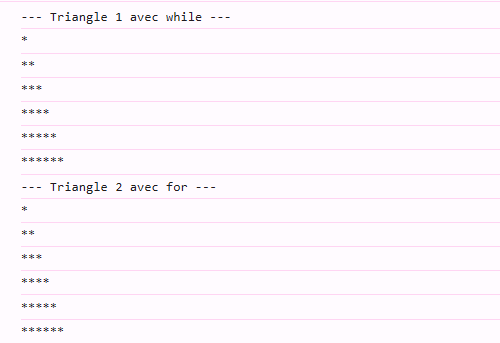
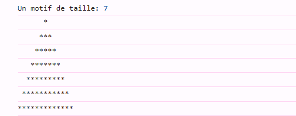
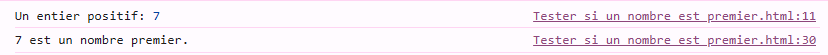
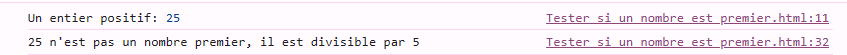
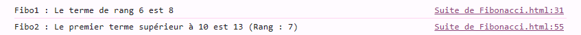
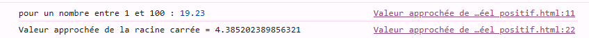

# — TD n◦1: Introduction à JavaScript — Types simples, variables et instructions de base
Master SDIA — Technologies du Web & Web Sémantique

**Étudiante**  MAJRI Salma 

**Encadrante**  Prof. AGHERAI Oumayma 

**Langage**  JavaScript 

---

## Objectifs

Expérimenter les constructions de base de JavaScript : types simples, déclarations de variables, instructions de contrôle et itérations.

---

## Exercice 1 — Conversion de températures `degreC()`

Convertir une température Fahrenheit en Celsius

**Exécution :**

---

## Exercice 2 — Conversion de durées `hjms()`

Convertir un nombre de secondes en jours, heures, minutes et secondes.

**Exécution :**

---

## Exercice 3 — Classer 3 nombres `troisNombres()`

Saisir 3 entiers et les afficher triés dans l'ordre croissant.

**Exécution :**

---

## Exercice 4 — Motifs en escalier `triangle1()` / `triangle2()`

Afficher un triangle de `*` de taille n :
- **a)** `triangle1()` — avec `while`
- **b)** `triangle2()` — avec `for`

**Exécution :**

---

## Exercice 4-bis — Pyramide `pyramide()`

Afficher une pyramide centrée de `*` de taille n.

**Exécution :**

---

## Exercice 5 — Nombre premier `Premier()`

Tester si un entier est premier (diviseurs : 1 et lui-même uniquement).

**Exécution — nombre premier :**

**Exécution — nombre non premier :**

---

## Exercice 6 — Suite de Fibonacci `Fibo1()` / `Fibo2()`

- **a)** `Fibo1()` — calcule le n-ième terme
- **b)** `Fibo2()` — trouve le premier terme supérieur à un seuil

**Exécution :**

---

## Exercice 7 — Racine carrée approchée `Raca1()`

suite convergente vers √A .

**Exécution :**

